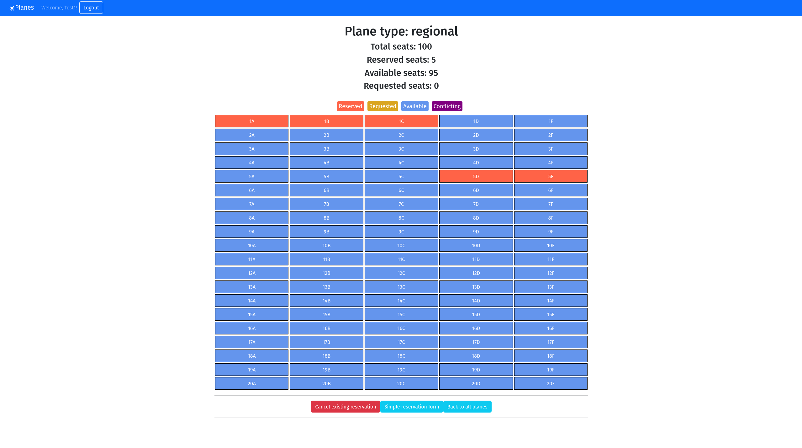

# Exam #2: "Airplane Seats"

This is an exam of the course Web Applications 1 at Politecnico di Torino, it was evaluated a 30 with honor mark. A posteriori I figured there is a mistake in the automatic assignment corresponding the ReservationForm component, which doesn't update the already reserved seats before booking the N requested ones (this is easily fixable by adding a GET HTTP call before the computation of the POST HTTP request's body, both about the plane).

The exam text can be found [here](https://docs.google.com/document/d/1D0asOxWrcH8Kk44I7UkGmicEHdAxgLvB69KZ8Gj3fNE).

## React Client Application Routes

- Route `/`: page containing airplanes list
- Route `/panes/:id`: page cantaining the airplane seats that permits booking and cancelation with graphical interface
- Route `/panes/:id/form`: page containing the airplane seats that permits booking and cancelation
- Route `/login`: page containing the login form

## API Server

- Authentication stuff
  - GET `/api/session/current`
    - request parameters: credentials for passport authentication;
    - response body: 
      ```
      {
        "id": 1,
        "username": "test1@email.com",
        "name": "Test1"
      }
      ```
    - response status: `200 OK` (success) or `401 Not authenticated`;
  - POST `/api/sessions`
    - request parameters: credentials for passport authentication, content-type: application/json;
    - request body:
      ```
      {
        "username": "test1@email.com",
        "password": ""
      }
      ```
    - response body:
      ```
      {
        "id": 1,
        "username": "test1@email.com",
        "name": "Test1"
      }
      ```
    - response status: `201 Successful login` or `401 Wrong credentials`;
  - DELETE `/api/session/current`
    - request parameters: credentials for passport authentication;
    - response status: `200 Successful logout`;
- List all planes
  - GET `/api/planes`
    - response body:
      ```
      [
        {
          "id": 1,
          "F": 15,
          "P": 4,
          "type": "local"
        },
        {
          "id": 2,
          "F": 20,
          "P": 5,
          "type": "regional"
        },
        {
          "id": 3,
          "F": 25,
          "P": 6,
          "type": "international"
        }
      ]
      ```
    - response status: `200 OK` (success) or `500 Internal Server Error` (generic error)
- Show a plane's status
  - GET `/api/planes/<id>`
    - request parameters: plane's id;
    - response body: contains a list of all the reserved seats
      ```
      {
        "id": 1,
        "type": "local",
        "F": 15,
        "P": 4,
        "reservedSeats":
          [
            {
              "id": 1,
              "planeId": 1,
              "userId": 1,
              "F": 1,
              "P": "A"
            },
            {
              "id": 2,
              "planeId": 1,
              "userId": 1,
              "F": 2,
              "P": "A"
            },
            {
              "id": 3,
              "planeId": 1,
              "userId": 1,
              "F": 3,
              "P": "A"
            },
            ...
          ]
      }
      ```
    - response status: `200 OK` (success), `404 Not found` or `500 Internal Server Error` (generic error);
- Reserve seats
  - POST `/api/planes/`
    - request parameters: user's selected seats, content-type: application/json;
    - request body:
      ```
      {
        "requested":
        [
          {
            "planeId": 1,
            "userId": 1,
            "F": 1,
            "P": "A"
          },
          {
            "planeId": 1,
            "userId": 1,
            "F": 2,
            "P": "A"
          }
        ]
      }
      ```
    - response body: "Reserved 2 seat/s";
    - response status: `200 OK` (success), `400 Bad Request` (one or more of the selected seats are already reserved), `401 Unauthorized` or `500 Internal Server Error` (generic error);
- Delete a reservation
  - DELETE `/api/planes/`
    - request parameters: user id, content-type: application/json;
    - request body:
      ```
      {
        "planeId": 1,
        "userId": 1
      }
      ```
    - response body: "Deleted reservation for user id = 1 on plane id = 1;
    - response status: `200 OK` (success), `400 Bad Request` (the selected user has no reservation on the selected plane), `401 Unauthorized` or `500 Internal Server Error` (generic error);

## Database Tables

- Table `users` - contains user's details: id, email, name, hash, salt;
- Table `planes` - contains plane's details: id, type, F, P, occupied;
- Table `reservations` - contains reservation's details: id, planeId, userId, F, P;

## Main React Components

- `Planes` (in `PlanesComponents.jsx`): shows the list of planes available for booking;
- `NavHeader` (in `NavbarComponents.jsx`): displays a navbar containing the name of the website and a button to get to login and logout;
- `FormLogin` (in `AuthComponents.jsx`): permits user authentication;
- `NofFound` (in `NotFoundComponents.jsx`): catches every URL not implemented by other routes;
- `PlaneView` (in `PlaneViewComponents.jsx`): permits to visualize a plane's status, to reserve seats and delete reservations;
- `ReservationForm` (in `ReservationFormComponents.jsx`): permits to reserve seats or delete present reservations;

## Screenshot



## Users Credentials

| email | password | comment |
| ----- | -------- | ------- |
| test1@email.com | password | has 2 seats reserved on local plane and 3 seats reserved on regional plane |
| test2@email.com | password | has 2 seats reserved on regional plane and 3 on international plane |
| test3@email.com | password | has no seats reserved |
| test4@email.com | password | has no seats reserved |
